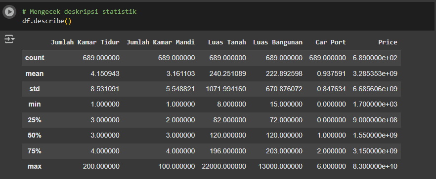
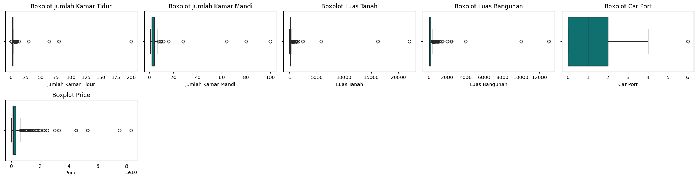
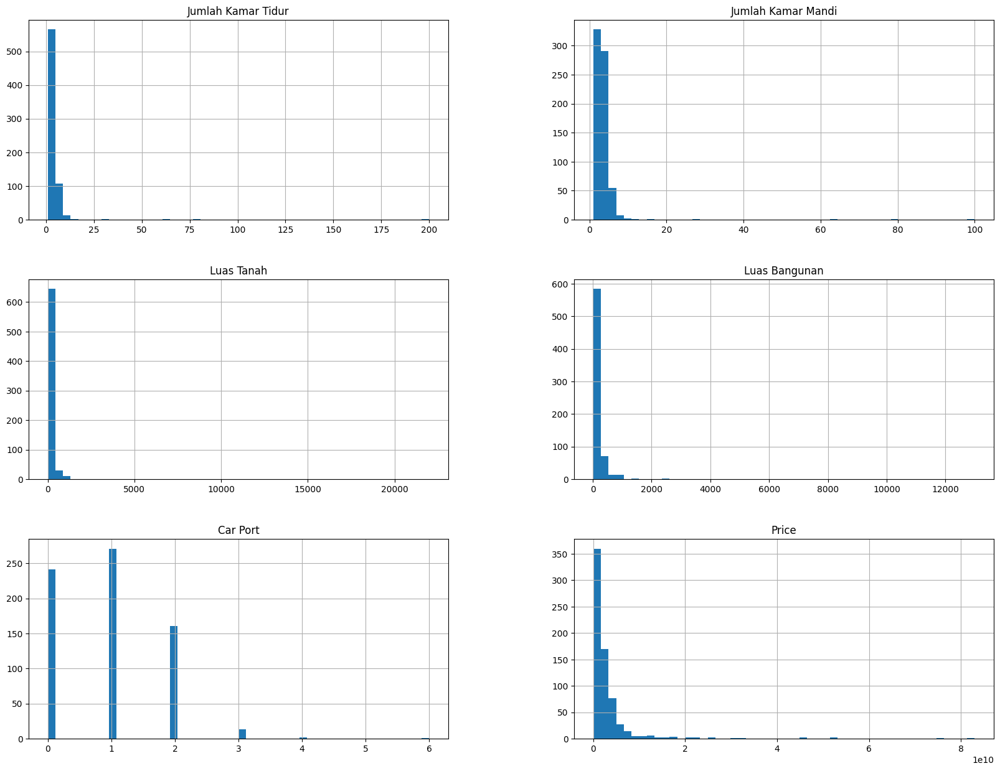
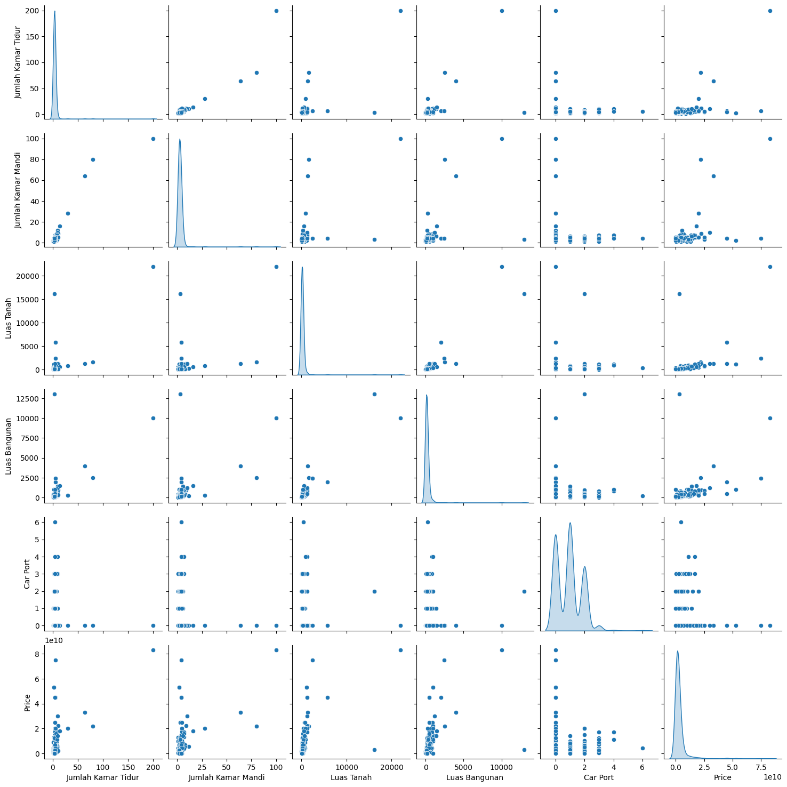
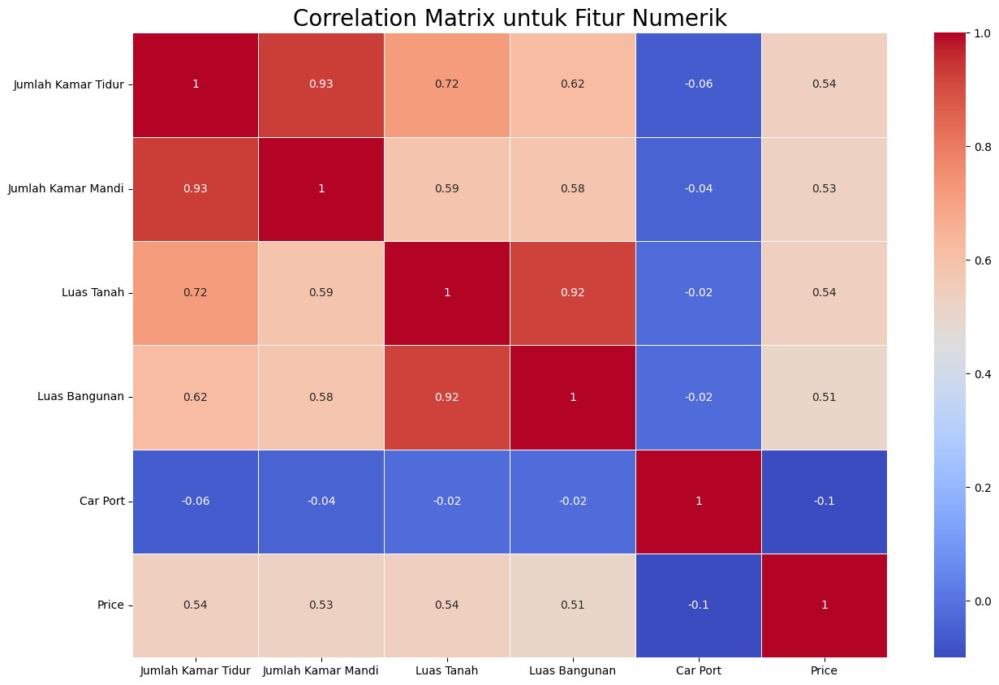

# Laporan Proyek Machine Learning - Bustanul Khair Rahman

## Domain Proyek

Sektor properti memegang peranan krusial dalam perekonomian suatu wilayah, mencerminkan dinamika sosial dan ekonomi yang kompleks. Di kota Makassar, sebagai salah satu pusat pertumbuhan ekonomi di Sulawesi Selatan, fluktuasi harga rumah menjadi perhatian penting bagi berbagai pihak, sebagaimana tercermin dalam Perkembangan Indeks Harga Konsumen/ Inflasi Kota Makassar Bulan Maret 2021 (BPS Makassar, 2021). Informasi akurat mengenai prediksi harga rumah dapat memberikan manfaat signifikan dalam pengambilan keputusan investasi, perencanaan pembangunan, serta formulasi kebijakan terkait perumahan. Namun, kompleksitas faktor-faktor yang mempengaruhi harga properti, mulai dari karakteristik fisik bangunan, lokasi strategis, hingga kondisi pasar secara keseluruhan, menjadikan prediksi harga rumah sebagai tantangan yang menarik untuk dieksplorasi (Goodfellow et al., 2016). Seiring dengan kemajuan teknologi dan ketersediaan data yang semakin melimpah, pendekatan berbasis machine learning menawarkan potensi yang besar untuk mengembangkan model prediksi yang lebih akurat dan efisien (Jordan & Mitchell, 2015). Beberapa studi telah menunjukkan keberhasilan algoritma seperti Random Forest Regressor dan K-Nearest Neighbors (KNN) dalam memprediksi harga rumah (Rais et al., 2024; Kurniawan et al., 2024). Proyek ini bertujuan untuk mengatasi tantangan tersebut dengan memanfaatkan algoritma Random Forest Regressor, dan K-Nearest Neighbors (KNN) untuk memprediksi harga rumah di kota Makassar, dengan harapan dapat memberikan kontribusi yang berharga bagi pemahaman dan pengambilan keputusan dalam pasar properti lokal.

## Business Understanding
### Problem Statements

1. Bagaimana cara memprediksi harga rumah di Kota Makassar secara akurat berdasarkan fitur-fitur seperti lokasi, jumlah kamar tidur dan mandi, luas tanah, luas bangunan, serta ketersediaan carport?
    - Masalah ini timbul karena fluktuasi harga properti yang cukup tinggi, sementara masyarakat dan investor membutuhkan informasi yang akurat untuk pengambilan keputusan.
2. Algoritma machine learning mana yang memberikan performa terbaik dalam memprediksi harga rumah di Kota Makassar?
    - Banyaknya algoritma regresi yang tersedia menimbulkan tantangan dalam memilih model yang paling sesuai dengan karakteristik data lokal Makassar. 
3. Apakah model yang dibangun mampu digunakan untuk melakukan prediksi harga rumah secara konsisten di berbagai rentang harga?
    - Diperlukan validasi untuk memastikan bahwa model tidak hanya akurat di harga rata-rata, tetapi juga pada harga ekstrem (mahal atau murah).

### Goals

1. Membangun model prediktif harga rumah berbasis machine learning yang mampu menghasilkan estimasi harga yang mendekati harga sebenarnya dengan error yang minimal.
2. Mengevaluasi dan membandingkan performa tiga algoritma regresi populer yaitu K-Nearest Neighbors (KNN), Random Forest Regressor (RF), dan AdaBoost Regressor dalam konteks pasar properti Makassar.

### Solution statements

1. Mengimplementasikan tiga algoritma machine learning regresi:
    - Menggunakan K-Nearest Neighbors, Random Forest Regressor, dan AdaBoost Regressor sebagai baseline model untuk memprediksi harga rumah.
    - Setiap model akan dievaluasi menggunakan metrik Mean Squared Error (MSE)
2. Melakukan perbandingan performa antar model berdasarkan hasil evaluasi:
    - Memilih model terbaik berdasarkan nilai MSE terendah pada data test.

## Data Understanding

Sumber data berasal dari Scraping data secara mandiri pada website penyedia harga rumah yang saya filter berdasarkan kota Makassar pada situs [berikut](https://www.rumah123.com/jual/makassar/rumah/)

### Variabel-variabel pada Makassar House Price dataset adalah sebagai berikut:
- Title : Judul iklan yang diberikan kepada promotor.
- Lokasi : lokasi rumah yang ditawarkan.
- Jumlah Kamar Tidur : jumlah kamar tidur yang direpresentasikan dalam bentuk integer
- Jumlah Kamar Mandi : jumlah kamar mandi yang direpresentasikan dalam bentuk integer
- Luas Tanah : luas tanah yang direpresentasikan dalam satuan m²
- Luas Bangunan : luas bangunan yang direpresentasikan dalam satuan m²
- Car Port : merepresentasikan atau mengindikasikan tempat parkir beratap terbuka atau semi terbuka
- Price : Harga rumah 
- Timestamp : waktu saat berhasil mendapatkan data dari hasil scraping

### EDA pada Dataset

1. Outliers atau anomali pada data

Dapat dilihat innaccurate atau anomali pada data yang menunjukkan 200 jumlah pada kamar tidur, 100 pada kamar mandi, dan price yang menunjukkan harga 1700. Hal ini saya anggap anomali karena tidak logis jika properti rumah memiliki data seperti itu

2. Mengecek Outliers dengan visualisasi

Outliers merupakan data anomali seperti yang ada pada poin pertama. kali ini kita melakukan visualisasi menggunakan boxplot

3. Univariate Analysis - Numerical Features

Sebagian besar fitur memiliki distribusi skewed ke kanan. banyak outlier yang berpotensi mengganggu peforma model

4. Mengmati korelasi fitur menggunakan pairplot

Fitur 'Jumlah Kamar Tidur', 'Jumlah Kamar Mandi', 'Luas Tanah', 'Luas Bangunan' memiliki korelasi terhadap 'Price' walaupun sedikit lemah dikarenakan masih banyak outliers.

5. Mengevaluasi skor korelasi dengan correlation matrix

Dapat dilihat 'Jumlah Kamar Tidur', 'Jumlah Kamar Mandi', 'Luas Tanah', 'Luas Bangunan' memiliki angka mendekati 1 terhadap 'Price' yang mengindikasikan adanya korelasi terhadap fitur tersebut.

## Data Preparation
Setelah menilai data dari tahap Data Understanding. Maka beberapa tahapan Data Preparation sebagai berikut:

1. Menangani Outliers - Melakukan filtering atau menggunakan metode IQR (Interquartile Range) untuk menghapus data di luar batas wajar. Outliers dapat menyebabkan model salah belajar karena mereka mendominasi pola data
2. Menangani Innaccurate Data - Melakuakn imputasi dengan nilai rata-rata karena masih ada data anomali pda price yaitu 1700. Data tidak akurat bisa menyebabkan bias dan mengurangi peforma model karena input tidak sesuai realitas 
3. Splitting Dataset - Mengambil beberapa fitur penting yang dilihat dari correlation matrix, kemudian membagi dataset menjadi data latih (training) dan data uji (testing) dengan rasio umum seperti 80:20. SPlitting penting agar model bisa diuji keandalannya dalam memprediksi data baru yang belum dilihat
4. Standarisasi - Melakukan standarisasi menggunakan StandarScaler pada fitur numeric. Standarisasi penting untuk menghindari fitur dengan skala besar mendominasi perhitungan dalam algritma machine learning

## Modeling
Tahapan ini berfokus pada proses membangun model regresi untuk memprediksi harga properti berdasarkan fitur-fitur seperti jumlah kamar tidur, kamar mandi, luas tanah, luas bangunan, dan car port

**Model yang Digunakan:**
1. K-Nearest Neighbors Regressor (KNN)
- **Kelebihan**:
    - sederhana dan mudah dipahami
    - tidak memrlukan asumsi distribusi data
- **Kekurangan**:
    - sensitif terhadap outlier dan skala fitur
    - waktu prediksi bisa lambat untuk dataset besar
2. Random Forest Regressor
- **Kelebihan**:
    - Stabil terhadap oulier dan noise
    - Memberikan feature importance
- **Kekurangan**:
    - Interpretasi lebih sulit dibandingkan model linear
    - Dapat memakan banyak memori
3. AdaBoost Regressor
- **Kelebihan**:
    - Baik dalam menangani data yang tidak seimbang
    - Memperbaiki model sebelumnya
- **Kekurangan**:
    - Lebih rentan terhadap noise
    - Peforma tergantung pada base estimator

**Model Terbaik**
Jika dilihat dari hasil evaluasi menggunakan metrik mse. **AdaBoost Regressor** adalah model terbaik dengan prediksi yang paling mendekati jika dilakukan prediksi terhadap nilai aktual.

## Evaluation
Pada proyek ini, karena permasalahan yang diselesaikan merupakan kasus regresi (prediksi harga rumah), maka metrik evaluasi yang digunakan adalah Mean Squared Error (MSE).

### Penjelasan Metrik
**Mean Squared Error (MSE)**
MSE mengukur rata-rata dari kuadrat selisih antara nilai aktual (y_true) dan prediksi (y_pred):

MSE = (1/n) * Σᵢⁿ (yᵢ - ŷᵢ)²

Keterangan:
- yᵢ  = nilai aktual
- ŷᵢ  = nilai prediksi
- n   = jumlah sampel
 
- Semakin kecil nilai MSE, semakin baik model dalam memprediksi.
- MSE sangat sensitif terhadap outlier karena menggunakan kuadrat dari error.

### Interpretasi
1. KNN Regressor
- Memiliki nilai MSE paling tinggi di antara ketiga model, baik pada data train maupun test.
- Hal ini menunjukkan bahwa model kurang mampu menangkap pola dalam data, dan mungkin terlalu sensitif terhadap tetangga terdekat tanpa mempertimbangkan kompleksitas global data.
2. Random Forest Regressor
- Menunjukkan keseimbangan terbaik antara data train dan test.
- Meskipun nilai MSE train cukup rendah, performa pada data test menjadi yang terbaik (paling kecil), menunjukkan generalisasi yang baik.
- Random Forest cocok untuk data kompleks dan nonlinear seperti harga properti karena mampu menangkap interaksi fitur yang kompleks.
3. AdaBoost Regressor (Boosting)
- Performa cukup baik dan terdekat dengan Random Forest di data test, tetapi sedikit lebih buruk.
- Nilai MSE train cukup rendah, menunjukkan model mampu mempelajari data latih dengan baik.
- Cocok untuk meningkatkan akurasi dari model-model lemah secara bertahap.
